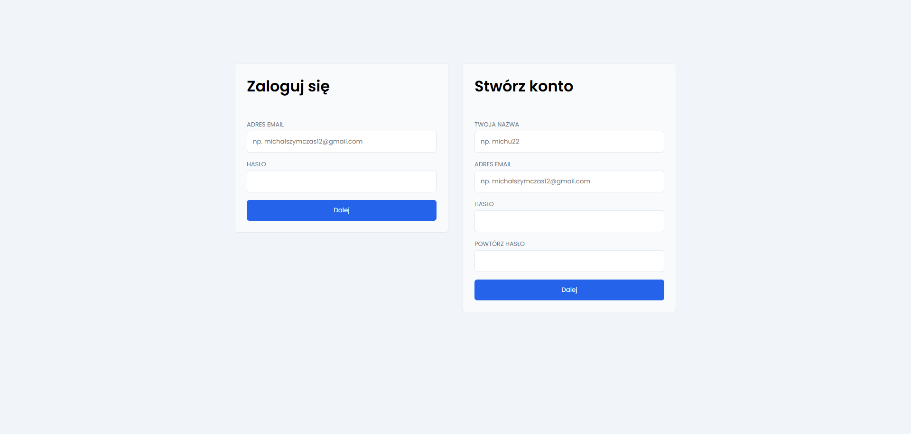
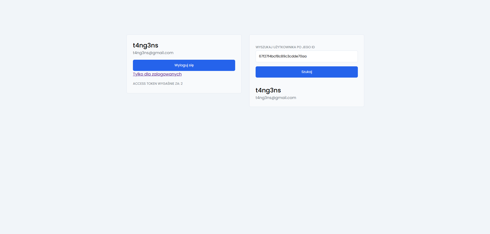

## Express-mongodb-react-template

Szablon do autoryzacji użytkowników na stronie
* Serwer - express, mongoose, jsonwebtoken
* Klient - react, axios, react-query, styled-components, zustand

## Kilka zdjęć strony




## Jak uruchomić

1. Pobranie wymaganych bibliotek w folderze klienta i serwera.

```sh
   npm install
```

2. Dodanie plików `.env` w folderze klienta i serwera, wzorując się na `.env.example`.

3. Włączenie po koleji klienta i serwera

 ```sh
    npm run dev
```
